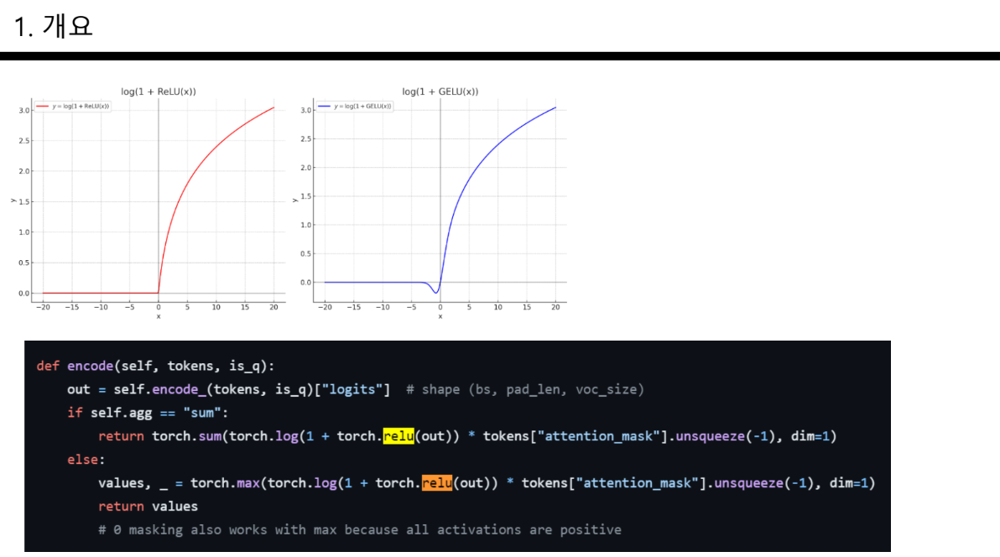

This summer, I participated in the TREC 2024 Product Search.

<!--more-->

This summer, our Information Mining Lab took part in the TREC 2024 Product Search.  
At first, many things were unfamiliar, and there were many parts I didn't understand.

Since I had only used Python for solving algorithm problems or web scraping, my unfamiliarity with other aspects became a significant weakness.

However, through reading papers and learning various codes during the process,  
by the end of the competition, I could feel myself growing.
